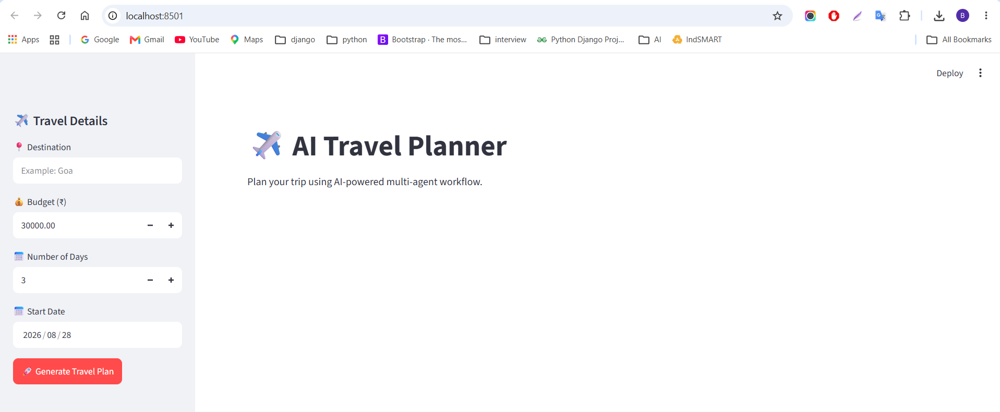
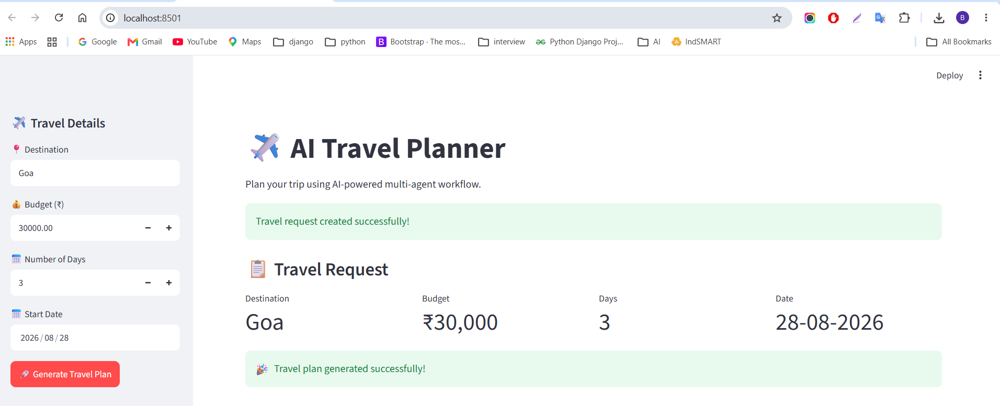
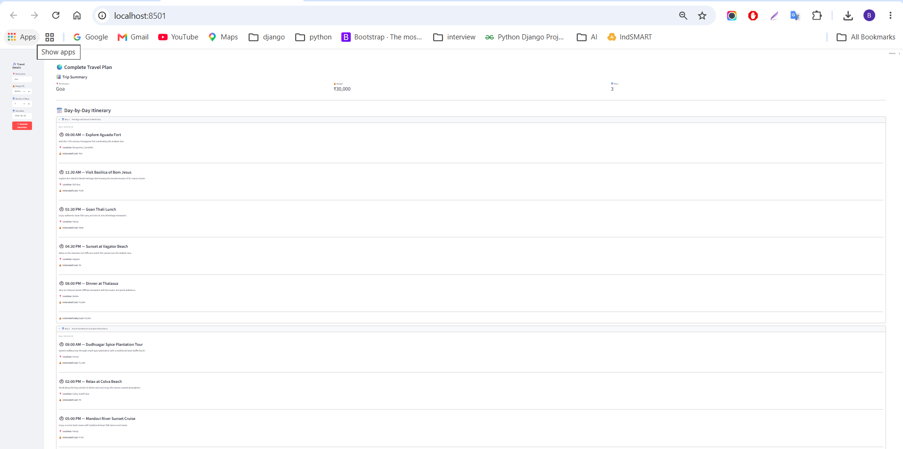
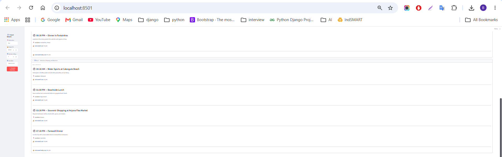
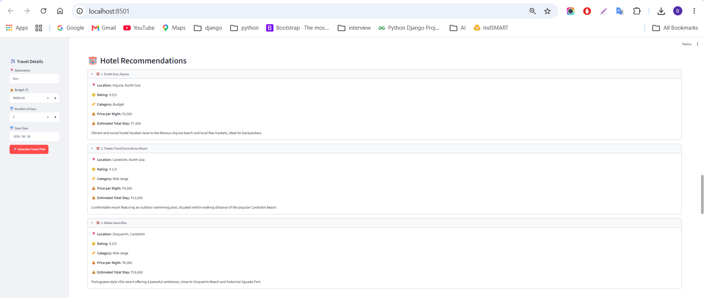
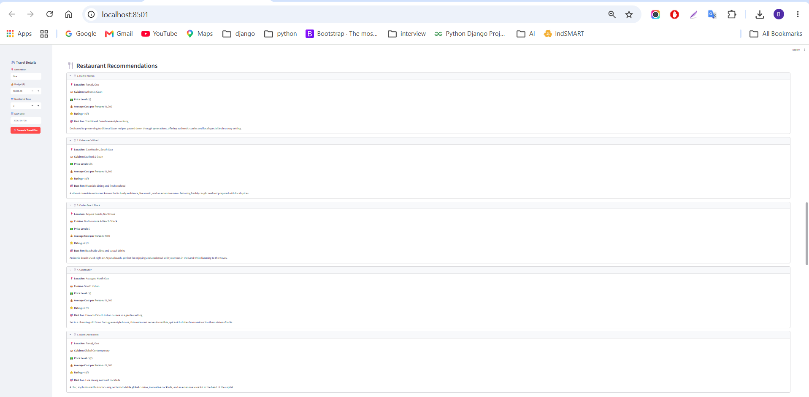
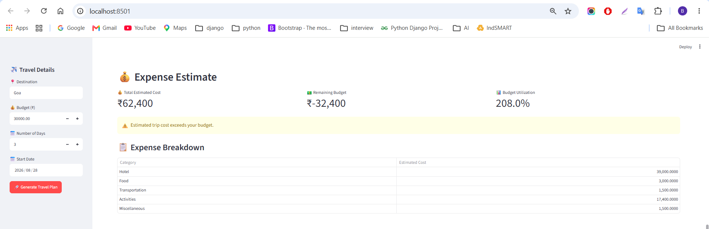
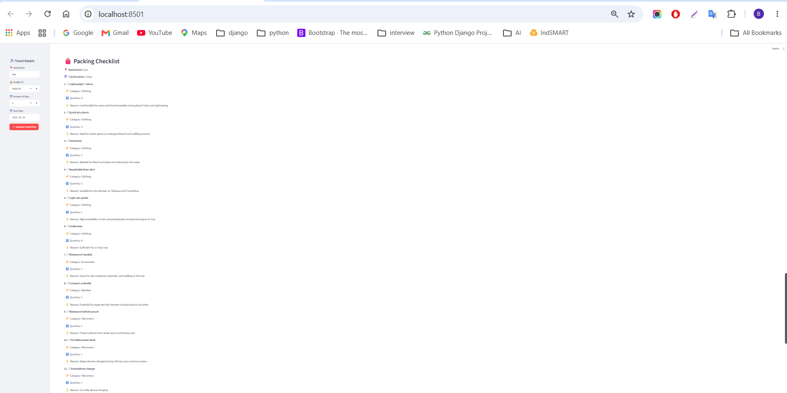
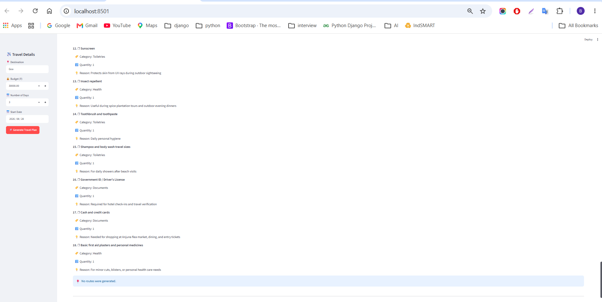

# ✈️ AI Travel Planner

An AI-powered travel planning application built with **Python, Streamlit, Google Gemini, Pydantic, and a multi-agent architecture**.

The application generates a complete travel plan based on the user's destination, budget, number of days, and start date.

It combines multiple specialized AI agents and tools to generate:

- 🗓️ Day-by-day itinerary
- 🏨 Hotel recommendations
- 🍴 Restaurant recommendations
- 🌤️ Weather forecast
- 💰 Expense estimation
- 🎒 Packing checklist
- 📍 Maps and route information

---

## 🚀 Features

### 📋 Travel Request

Users can provide:

- 📍 Destination
- 💰 Travel budget
- 📅 Number of travel days
- 🗓️ Start date

The application validates the input and creates a structured travel request.

---

### 🗓️ AI Itinerary Planning

The itinerary agent generates a day-by-day travel schedule including:

- Activity time
- Activity title
- Description
- Location
- Estimated cost
- Daily estimated cost

---

### 🏨 Hotel Recommendations

The hotel agent provides hotel suggestions with:

- Hotel name
- Location
- Rating
- Category
- Price per night
- Estimated total stay cost
- Description

---

### 🍴 Restaurant Recommendations

The restaurant agent generates restaurant suggestions including:

- Restaurant name
- Location
- Cuisine
- Price level
- Average cost per person
- Rating
- Best for
- Description

---

### 🌤️ Weather Forecast

The weather tool provides forecast information including:

- Location
- Latitude
- Longitude
- Timezone
- Maximum temperature
- Minimum temperature
- Precipitation probability
- Precipitation amount
- Weather code

---

### 💰 Expense Estimation

The expense tool calculates estimated travel expenses for:

- 🏨 Hotel
- 🍴 Food
- 🚗 Transportation
- 🎯 Activities
- 📦 Miscellaneous expenses

It also calculates:

- Total estimated cost
- Remaining budget
- Budget utilization percentage
- Budget status

---

### 🎒 Packing Checklist

The packing agent generates a destination-specific checklist with:

- Item
- Category
- Quantity
- Reason

---

### 📍 Maps & Routes

The Maps tool supports:

- Location geocoding
- Route calculation
- Distance information
- Estimated travel duration
- Origin coordinates
- Destination coordinates

---

## 🤖 Multi-Agent Architecture

The application uses a **Master Travel Planner Agent** that coordinates multiple specialized agents and tools.

```text
                    ┌─────────────────────────┐
                    │   User Travel Request   │
                    │ Destination / Budget    │
                    │ Days / Start Date       │
                    └────────────┬────────────┘
                                 │
                                 ▼
                    ┌─────────────────────────┐
                    │ Master Travel Planner   │
                    │         Agent           │
                    └────────────┬────────────┘
                                 │
             ┌───────────────────┼───────────────────┐
             │                   │                   │
             ▼                   ▼                   ▼
      Planning Agent      Itinerary Agent      Hotel Agent
             │                   │                   │
             ▼                   ▼                   ▼
      Restaurant Agent    Packing Agent       Weather Tool
             │                   │                   │
             └───────────────────┼───────────────────┘
                                 │
                    ┌────────────┴────────────┐
                    │                         │
                    ▼                         ▼
              Expense Tool               Maps Tool
                    │                         │
                    └────────────┬────────────┘
                                 │
                                 ▼
                    ┌─────────────────────────┐
                    │   Complete Travel Plan  │
                    └─────────────────────────┘
````

---

## 🏗️ Project Structure

```text
AI_Travel_Planner/
│
├── agents/
│   ├── __init__.py
│   ├── hotel_agent.py
│   ├── itinerary_agent.py
│   ├── master_travel_agent.py
│   ├── packing_agent.py
│   ├── planning_agent.py
│   ├── restaurant_agent.py
│   └── travel_agent.py
│
├── config/
│   ├── __init__.py
│   └── settings.py
│
├── logs/
│   └── app.log
│
├── models/
│   ├── __init__.py
│   ├── expense.py
│   ├── hotel.py
│   ├── itinerary.py
│   ├── maps.py
│   ├── master_travel_plan.py
│   ├── packing.py
│   ├── planning.py
│   ├── restaurant.py
│   ├── travel_plan.py
│   ├── travel_request.py
│   └── weather.py
│
├── reports/
│
├── screenshots/
│   ├── 01_home.png
│   ├── 02_travel_request.png
│   ├── 03_0_itinerary.png
│   ├── 03_1_itinerary.png
│   ├── 04_hotels.png
│   ├── 05_restaurants.png
│   ├── 06_weather.png
│   ├── 07_expenses.png
│   ├── 08_0_packing.png
│   └── 08_1_packing.png
│
├── tests/
│   ├── test_hotel_agent.py
│   ├── test_hotel_model.py
│   ├── test_itinerary_agent.py
│   ├── test_itinerary_validation.py
│   ├── test_maps_model.py
│   ├── test_maps_tool.py
│   ├── test_master_agent_initialization.py
│   ├── test_master_travel_agent.py
│   ├── test_master_workflow.py
│   ├── test_models.py
│   ├── test_packing_agent.py
│   ├── test_packing_model.py
│   ├── test_planning_agent.py
│   ├── test_real_maps_tool.py
│   ├── test_real_weather_tool.py
│   ├── test_restaurant_agent.py
│   ├── test_restaurant_model.py
│   ├── test_settings.py
│   ├── test_travel_agent.py
│   ├── test_weather_model.py
│   └── test_weather_tool.py
│
├── tools/
│   ├── __init__.py
│   ├── expense_tool.py
│   ├── maps_tool.py
│   └── weather_tool.py
│
├── utils/
│   ├── __init__.py
│   └── logger.py
│
├── .env
├── .gitignore
├── app.py
├── LICENSE
├── README.md
└── requirements.txt
```

---

## 🛠️ Technologies Used

| Technology           | Purpose                               |
| -------------------- | ------------------------------------- |
| Python               | Application development               |
| Streamlit            | Web UI                                |
| Google Gemini        | Generative AI                         |
| Pydantic             | Data validation and structured models |
| pytest               | Automated testing                     |
| Open-Meteo           | Weather data                          |
| Maps / Geocoding API | Location and route information        |
| Git                  | Version control                       |
| GitHub               | Source code hosting                   |

---

## 📦 Installation

### 1. Clone the repository

```bash
git clone https://github.com/balasminfotech/AI_Travel_Planner.git
```

### 2. Navigate to the project

```bash
cd AI_Travel_Planner
```

### 3. Create a virtual environment

```bash
python -m venv venv
```

### 4. Activate the virtual environment

#### Windows PowerShell

```powershell
venv\Scripts\Activate.ps1
```

#### Windows CMD

```cmd
venv\Scripts\activate
```

### 5. Install dependencies

```bash
pip install -r requirements.txt
```

---

## 🔐 Environment Variables

Create a `.env` file in the project root.

```env
GEMINI_API_KEY=your_gemini_api_key
```

Replace:

```text
your_gemini_api_key
```

with your actual Google Gemini API key.

**Do not commit your `.env` file to GitHub.**

The `.gitignore` file should exclude:

```text
.env
venv/
__pycache__/
.pytest_cache/
```

---

## ▶️ Run the Application

Start the Streamlit application:

```bash
streamlit run app.py
```

The application will open in your browser.

Default Streamlit URL:

```text
http://localhost:8501
```

---

# 📸 Application Screenshots

## 🏠 Home Page

The home page provides the main interface for entering travel information.



---

## 📋 Travel Request

Users can enter the destination, budget, number of days, and start date.



---

## 🗓️ AI Itinerary

The AI generates a detailed day-by-day itinerary with activities, locations, timings, and estimated costs.





---

## 🏨 Hotel Recommendations

The application provides AI-generated hotel recommendations with ratings, categories, and estimated prices.



---

## 🍴 Restaurant Recommendations

The restaurant section provides recommended restaurants along with cuisine, pricing, ratings, and other information.



---

## 🌤️ Weather Forecast

The weather section displays forecast information for the selected destination.


---

## 💰 Expense Estimate

The expense section provides a complete breakdown of the estimated travel expenses.



---

## 🎒 Packing Checklist

The AI generates a destination-specific packing checklist.





---

# 🧪 Testing

The project contains automated tests for models, agents, tools, workflows, and real API integrations.

Run the complete test suite:

```bash
python -m pytest -v
```

Example test result:

```text
85 passed
```

Run the model tests separately:

```bash
python -m pytest tests/test_models.py -v
```

---

## 📊 Test Coverage

The test suite covers:

* Travel Request Model
* Itinerary Models
* Hotel Models
* Restaurant Models
* Weather Models
* Expense Models
* Packing Models
* Maps Models
* Planning Agent
* Travel Agent
* Itinerary Agent
* Hotel Agent
* Restaurant Agent
* Packing Agent
* Master Travel Planner Agent
* Weather Tool
* Expense Tool
* Maps Tool
* Application Settings
* Master Workflow

---

# 🔄 Application Workflow

```text
1. User enters travel details
             ↓
2. TravelRequest is created
             ↓
3. Master Travel Planner Agent starts
             ↓
4. Planning Agent creates travel strategy
             ↓
5. Itinerary Agent creates daily itinerary
             ↓
6. Hotel Agent recommends hotels
             ↓
7. Restaurant Agent recommends restaurants
             ↓
8. Weather Tool retrieves forecast
             ↓
9. Expense Tool calculates estimated expenses
             ↓
10. Packing Agent creates packing checklist
             ↓
11. Maps Tool calculates routes
             ↓
12. Complete Travel Plan displayed in Streamlit
```

---

# 🎯 Project Objectives

The main objectives of this project are:

* Build a practical **Agentic AI application**
* Implement a **multi-agent architecture**
* Use specialized AI agents for different travel tasks
* Integrate external tools and APIs
* Use Pydantic for structured AI outputs
* Build a user-friendly Streamlit interface
* Implement automated testing
* Follow a modular project architecture
* Demonstrate real-world Agentic AI development

---

# 🚀 Future Enhancements

Potential future improvements include:

* ✈️ Flight recommendations
* 🏨 Real-time hotel availability
* 🚕 Cab / transportation recommendations
* 💳 Currency conversion
* 🗺️ Interactive maps
* 📄 PDF travel report generation
* 📧 Email itinerary sharing
* 💾 Travel plan history
* 👤 User authentication
* 🌐 Multi-language support

---

# 👨‍💻 Author

**BALASUBRAMANIAN V.**

Python / Django Developer | Agentic AI Engineer

---
