# ✈️ AI Travel Planner

An AI-powered travel planning application built with **Python, Streamlit, Google Gemini, Pydantic, and a multi-agent architecture**.

The application generates a complete travel plan based on the user's destination, budget, number of days, and start date.

It combines multiple specialized AI agents and tools to generate:

- 🗓️ Day-by-day itinerary
- 🏨 Hotel recommendations
- 🍴 Restaurant recommendations
- 🌤️ Weather forecast
- 💰 Expense estimation
- 🎒 Packing checklist
- 📍 Maps and route information
- 📤 PDF, Markdown, and JSON export
- 🛡️ Graceful error handling and partial results
- 📝 Rotating application logs

---

## 🚀 Features

### 📋 Travel Request

Users can provide:

- 📍 Destination
- 💰 Travel budget
- 📅 Number of travel days
- 🗓️ Start date

The application validates the input and creates a structured travel request.

---

### 🗓️ AI Itinerary Planning

The itinerary agent generates a day-by-day travel schedule including:

- Activity time
- Activity title
- Description
- Location
- Estimated cost
- Daily estimated cost

---

### 🏨 Hotel Recommendations

The hotel agent provides hotel suggestions with:

- Hotel name
- Location
- Rating
- Category
- Price per night
- Estimated total stay cost
- Description

---

### 🍴 Restaurant Recommendations

The restaurant agent generates restaurant suggestions including:

- Restaurant name
- Location
- Cuisine
- Price level
- Average cost per person
- Rating
- Best for
- Description

---

### 🌤️ Weather Forecast

The weather tool provides forecast information including:

- Location
- Latitude
- Longitude
- Timezone
- Maximum temperature
- Minimum temperature
- Precipitation probability
- Precipitation amount
- Weather code

---

### 💰 Expense Estimation

The expense tool calculates estimated travel expenses for:

- 🏨 Hotel
- 🍴 Food
- 🚗 Transportation
- 🎯 Activities
- 📦 Miscellaneous expenses

It also calculates:

- Total estimated cost
- Remaining budget
- Budget utilization percentage
- Budget status

---

### 🎒 Packing Checklist

The packing agent generates a destination-specific checklist with:

- Item
- Category
- Quantity
- Reason

---

### 📍 Maps & Routes

The Maps tool supports:

- Location geocoding
- Route calculation
- Distance information
- Estimated travel duration
- Origin coordinates
- Destination coordinates

---

## 📤 Travel Plan Export

Generated travel plans can be downloaded directly from the Streamlit interface in three formats:

- 📄 PDF
- 📝 Markdown
- 📦 JSON

This makes the generated itinerary easy to save, share, inspect, or reuse in other applications.

---

## 🛡️ Error Handling and Partial Results

The application is designed to remain usable when an external service cannot complete part of the workflow. For example, weather or route generation can fail while the itinerary, hotels, restaurants, expenses, packing checklist, and other successfully generated sections remain available.

User-friendly warnings are displayed instead of terminating the complete travel-planning workflow.

---

## 📝 Application Logging

Runtime activity is recorded in `logs/app.log`. Logging is configured with a rotating file handler to avoid uncontrolled log-file growth and to prevent duplicate handlers.

Important application events such as successful plan storage, export generation, warnings, and exceptions can be recorded for troubleshooting and production verification.

---

## 📅 Weather Date Alignment

Weather requests are aligned with the selected trip start and end dates. If forecast data is unavailable for the requested travel period, the application handles the unavailable weather component gracefully without breaking the rest of the travel plan.

---

## 🤖 Multi-Agent Architecture

The application uses a **Master Travel Planner Agent** that coordinates multiple specialized agents and tools.

```text
                    ┌─────────────────────────┐
                    │   User Travel Request   │
                    │ Destination / Budget    │
                    │ Days / Start Date       │
                    └────────────┬────────────┘
                                 │
                                 ▼
                    ┌─────────────────────────┐
                    │ Master Travel Planner   │
                    │         Agent           │
                    └────────────┬────────────┘
                                 │
             ┌───────────────────┼───────────────────┐
             │                   │                   │
             ▼                   ▼                   ▼
      Planning Agent      Itinerary Agent      Hotel Agent
             │                   │                   │
             ▼                   ▼                   ▼
      Restaurant Agent    Packing Agent       Weather Tool
             │                   │                   │
             └───────────────────┼───────────────────┘
                                 │
                    ┌────────────┴────────────┐
                    │                         │
                    ▼                         ▼
              Expense Tool               Maps Tool
                    │                         │
                    └────────────┬────────────┘
                                 │
                                 ▼
                    ┌─────────────────────────┐
                    │   Complete Travel Plan  │
                    └─────────────────────────┘
```

---

## 🏗️ Project Structure

```text
AI_Travel_Planner/
│
├── agents/
│   ├── __init__.py
│   ├── hotel_agent.py
│   ├── itinerary_agent.py
│   ├── master_travel_agent.py
│   ├── packing_agent.py
│   ├── planning_agent.py
│   ├── restaurant_agent.py
│   └── travel_agent.py
│
├── config/
│   ├── __init__.py
│   └── settings.py
│
├── logs/
│   └── app.log
│
├── models/
│   ├── __init__.py
│   ├── expense.py
│   ├── hotel.py
│   ├── itinerary.py
│   ├── maps.py
│   ├── master_travel_plan.py
│   ├── packing.py
│   ├── planning.py
│   ├── restaurant.py
│   ├── travel_plan.py
│   ├── travel_request.py
│   └── weather.py
│
├── reports/
│
├── screenshots/
│   ├── 01-home-page.png
│   ├── 02-trip-overview.png
│   ├── 03-1-day-by-day-itinerary.png
│   ├── 03-2-day-by-day-itinerary.png
│   ├── 04-hotel-recommendations.png
│   ├── 05-restaurant-recommendations.png
│   ├── 06-weather-forecast.png
│   ├── 07-expense-dashboard.png
│   ├── 08-packing-checklist.png
│   ├── 09-maps-routes.png
│   ├── 10-export-travel-plan.png
│   ├── 11-error-handling.png
│   └── 12-logging.png
│
├── tests/
│   ├── test_error_handling.py
│   ├── test_expense_demo.py
│   ├── test_expense_model.py
│   ├── test_expense_tool.py
│   ├── test_export_utils.py
│   ├── test_gemini_hotel_agent.py
│   ├── test_gemini_itinerary_agent.py
│   ├── test_gemini_packing_agent.py
│   ├── test_gemini_planning_agent.py
│   ├── test_gemini_restaurant_agent.py
│   ├── test_gemini_travel_agent.py
│   ├── test_hotel_agent.py
│   ├── test_hotel_model.py
│   ├── test_itinerary_agent.py
│   ├── test_itinerary_validation.py
│   ├── test_logging.py
│   ├── test_maps_model.py
│   ├── test_maps_tool.py
│   ├── test_master_agent_initialization.py
│   ├── test_master_travel_agent.py
│   ├── test_master_workflow.py
│   ├── test_models.py
│   ├── test_packing_agent.py
│   ├── test_packing_model.py
│   ├── test_planning_agent.py
│   ├── test_real_maps_tool.py
│   ├── test_real_weather_tool.py
│   ├── test_restaurant_agent.py
│   ├── test_restaurant_model.py
│   ├── test_settings.py
│   ├── test_travel_agent.py
│   ├── test_weather_date_alignment.py
│   ├── test_weather_model.py
│   ├── test_weather_tool.py
│   └── test_weather_tool_forecast.py
│
├── tools/
│   ├── __init__.py
│   ├── expense_tool.py
│   ├── maps_tool.py
│   └── weather_tool.py
│
├── utils/
│   ├── __init__.py
│   ├── error_handler.py
│   ├── export_utils.py
│   └── logger.py
│
├── .env
├── .env.example
├── .gitignore
├── app.py
├── LICENSE
├── README.md
└── requirements.txt
```

---

## 🛠️ Technologies Used

| Technology           | Purpose                               |
| -------------------- | ------------------------------------- |
| Python               | Application development               |
| Streamlit            | Web UI                                |
| Google Gemini        | Generative AI                         |
| Pydantic             | Data validation and structured models |
| pytest               | Automated testing                     |
| Open-Meteo           | Weather data                          |
| Maps / Geocoding API | Location and route information        |
| Git                  | Version control                       |
| GitHub               | Source code hosting                   |

---

## 📦 Installation

### 1. Clone the repository

```bash
git clone https://github.com/balasminfotech/AI_Travel_Planner.git
```

### 2. Navigate to the project

```bash
cd AI_Travel_Planner
```

### 3. Create a virtual environment

```bash
python -m venv venv
```

### 4. Activate the virtual environment

#### Windows PowerShell

```powershell
venv\Scripts\Activate.ps1
```

#### Windows CMD

```cmd
venv\Scripts\activate
```

### 5. Install dependencies

```bash
pip install -r requirements.txt
```

---

## 🔐 Environment Variables

Create a `.env` file in the project root. You can use `.env.example` as the template for local configuration.

```env
GEMINI_API_KEY=your_gemini_api_key
```

Replace:

```text
your_gemini_api_key
```

with your actual Google Gemini API key.

**Do not commit your `.env` file to GitHub.**

The `.gitignore` file should exclude:

```text
.env
venv/
__pycache__/
.pytest_cache/
```

---

## ▶️ Run the Application

Start the Streamlit application:

```bash
streamlit run app.py
```

The application will open in your browser.

Default Streamlit URL:

```text
http://localhost:8501
```

---

# 📸 Application Screenshots

## 🏠 01 — Home Page

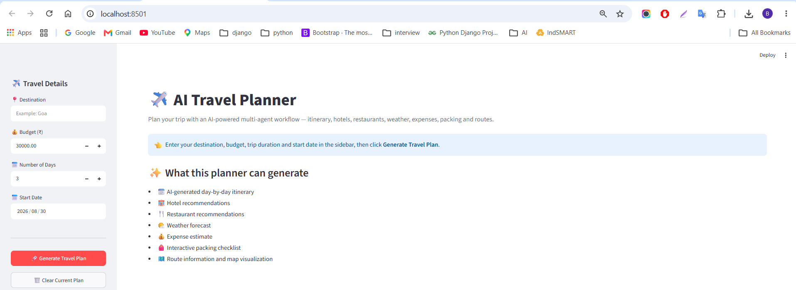

## 🌍 02 — Trip Overview

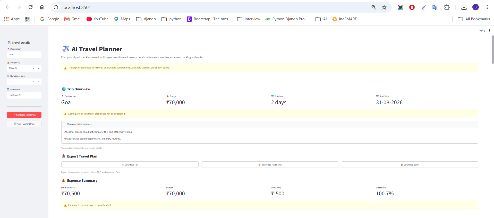

## 🗓️ 03 — Day-by-Day Itinerary

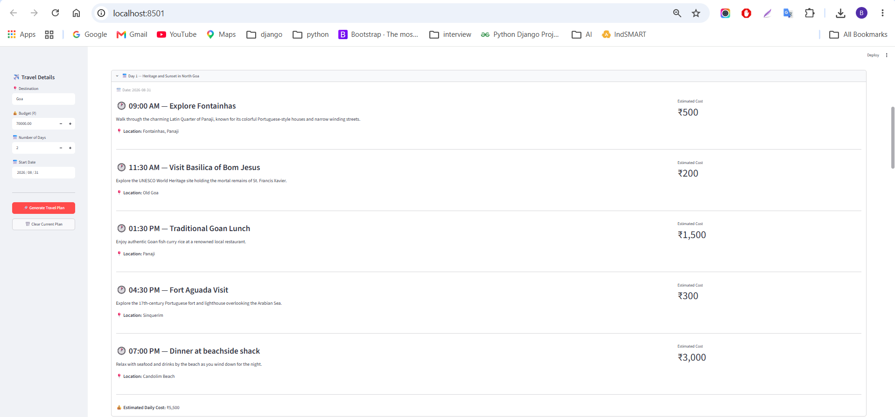

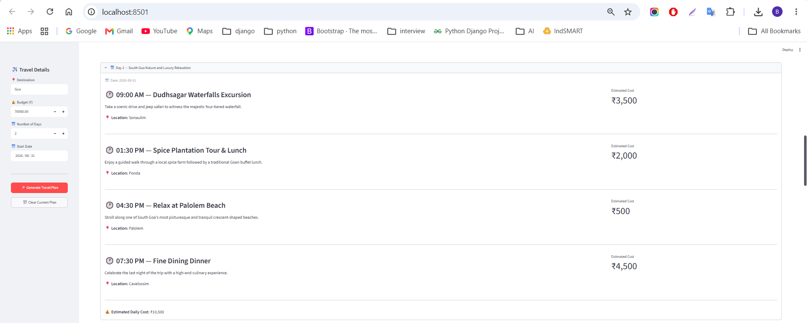

## 🏨 04 — Hotel Recommendations

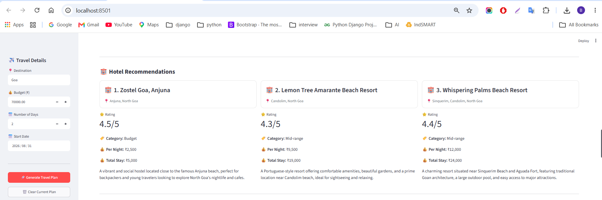

## 🍴 05 — Restaurant Recommendations

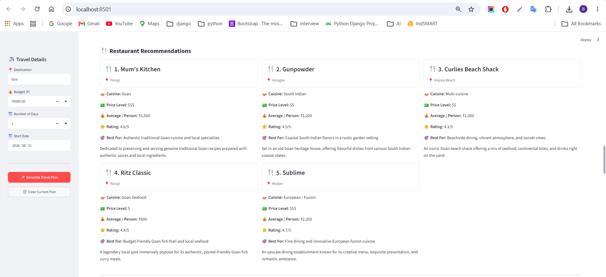

## 🌤️ 06 — Weather Forecast

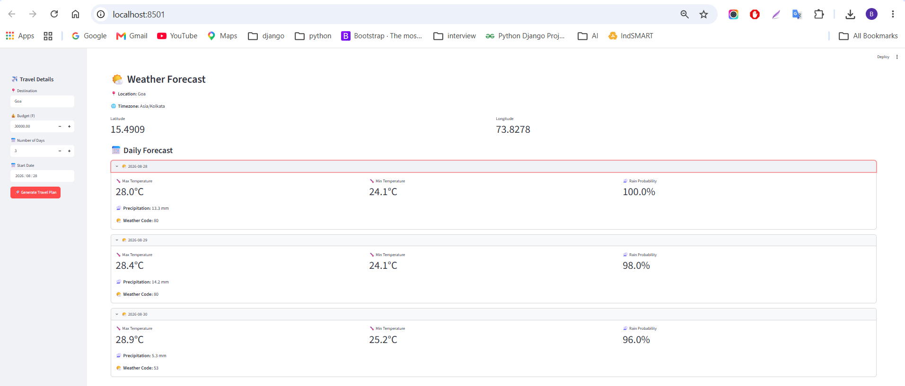

## 💰 07 — Expense Dashboard

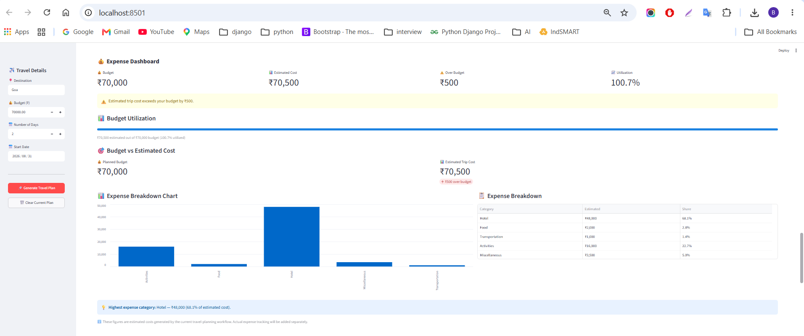

## 🎒 08 — Packing Checklist

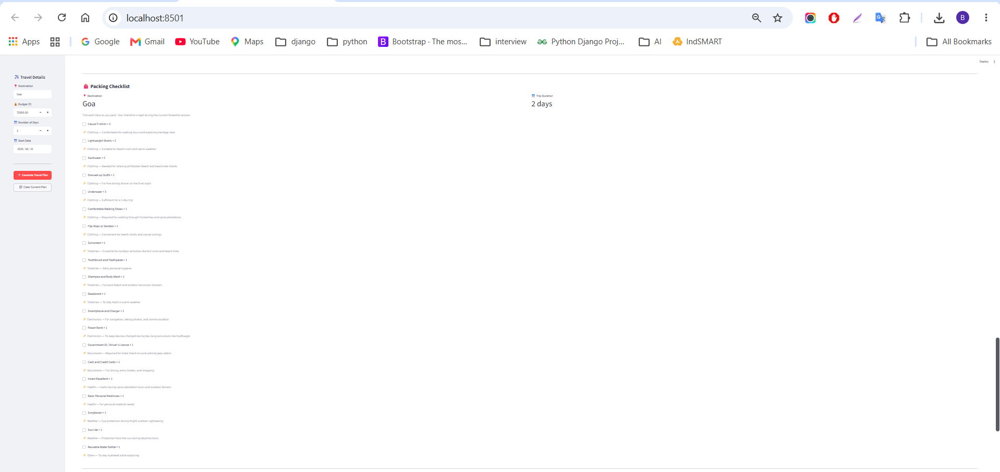

## 🗺️ 09 — Maps & Routes

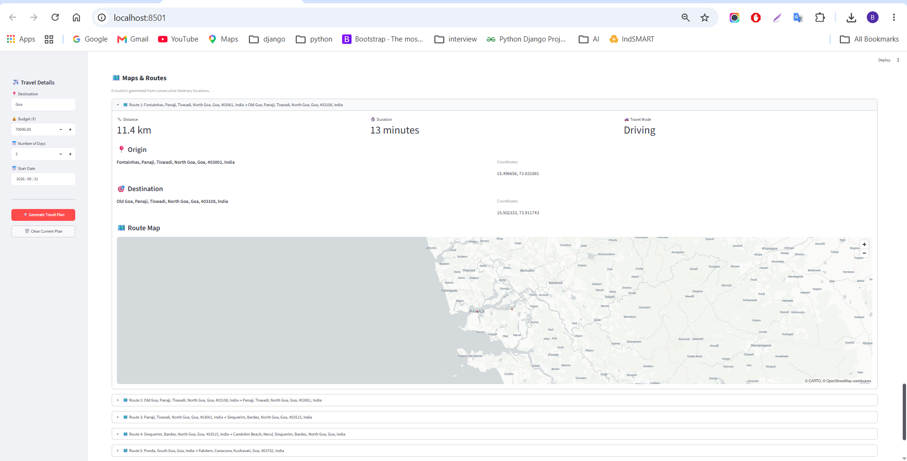

## 📤 10 — Export Travel Plan

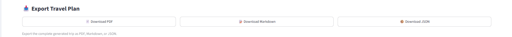

## 🛡️ 11 — Error Handling


## 📝 12 — Logging

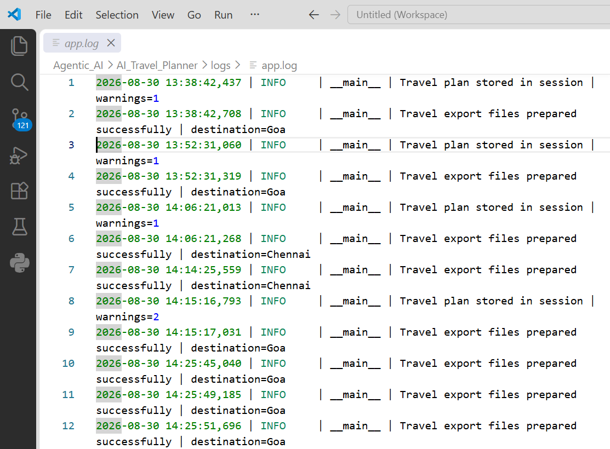

---

# 🧪 Testing

The project contains automated tests for models, agents, tools, workflows, and real API integrations.

Run the complete test suite:

```bash
python -m pytest -v
```

Example test result:

```text
95 passed in 31.43s
```

Run the model tests separately:

```bash
python -m pytest tests/test_models.py -v
```

---

## 📊 Test Coverage

The test suite covers:

* Travel Request Model
* Itinerary Models
* Hotel Models
* Restaurant Models
* Weather Models
* Expense Models
* Packing Models
* Maps Models
* Planning Agent
* Travel Agent
* Itinerary Agent
* Hotel Agent
* Restaurant Agent
* Packing Agent
* Master Travel Planner Agent
* Weather Tool
* Expense Tool
* Maps Tool
* Application Settings
* Master Workflow
* Export Utilities (PDF / Markdown / JSON)
* Error Handling and Partial Failures
* Logging Configuration
* Weather Date Alignment
* Real Weather Integration
* Real Maps / Routing Integration

---

# 🔄 Application Workflow

```text
1. User enters travel details
             ↓
2. TravelRequest is created
             ↓
3. Master Travel Planner Agent starts
             ↓
4. Planning Agent creates travel strategy
             ↓
5. Itinerary Agent creates daily itinerary
             ↓
6. Hotel Agent recommends hotels
             ↓
7. Restaurant Agent recommends restaurants
             ↓
8. Weather Tool retrieves forecast
             ↓
9. Expense Tool calculates estimated expenses
             ↓
10. Packing Agent creates packing checklist
             ↓
11. Maps Tool calculates routes
             ↓
12. Complete Travel Plan displayed in Streamlit
```

---

# 🎯 Project Objectives

The main objectives of this project are:

* Build a practical **Agentic AI application**
* Implement a **multi-agent architecture**
* Use specialized AI agents for different travel tasks
* Integrate external tools and APIs
* Use Pydantic for structured AI outputs
* Build a user-friendly Streamlit interface
* Implement automated testing
* Follow a modular project architecture
* Demonstrate real-world Agentic AI development

---

# 🚀 Future Enhancements

Potential future improvements include:

* ✈️ Flight recommendations
* 🏨 Real-time hotel availability
* 🚕 Cab / transportation recommendations
* 💳 Currency conversion
* 📧 Email itinerary sharing
* 💾 Travel plan history
* 👤 User authentication
* 🌐 Multi-language support

---

# 👨‍💻 Author

**BALASUBRAMANIAN V.**

Python / Django Developer | Agentic AI Engineer

---
